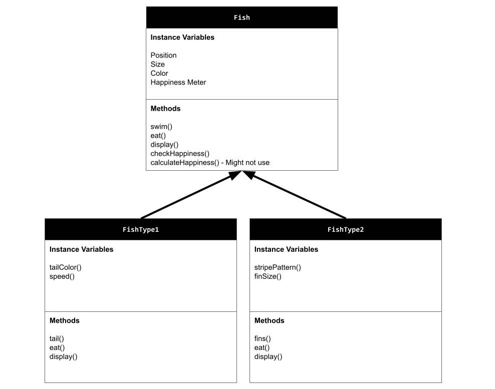
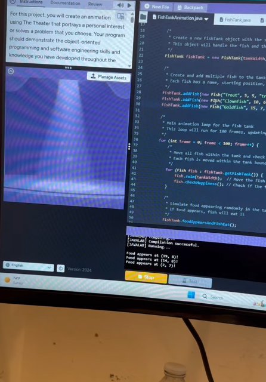

# Unit 7 - Creative Animation with The Theater Project

## Introduction

For this project, you will create an animation using The Theater that portrays a personal interest or solves a problem that you choose. Your program should demonstrate the object-oriented programming and software engineering skills and knowledge you have developed throughout the year.

## Requirements

Use your knowledge of object-oriented programming, data structures, and algorithms to create an animation using The Theater:

- **Use inheritance and polymorphism** – Create a superclass that represents shared attributes and behaviors with at least two subclasses that are more specific versions or variations of the superclass.
- **Method decomposition** – Use overloaded, overridden, and private methods to implement different versions of the same behavior, variations of a superclass behavior, and to improve code organization.
- **Use at least two data structures** - Use at least two 1D or 2D arrays or ArrayLists to store elements that are manipulated using loops and conditionals.
- **Implement one or more algorithms** – Implement one or more algorithms that use loops and two-way or multi-selection statements with compound Boolean expressions to analyze the data.
- **Create a visualization** – Create an animation that portrays a personal interest or solves a problem that you choose using objects, data structures, and methods.
- **Document your code** – Use comments to explain the purpose of the methods and code segments and note any preconditions and postconditions.

## Trello Board

Link the Trello board that you used to plan this project here. 

[My Trello planning board](https://trello.com/invite/b/67d4561af105200093d1e595/ATTI0bae767c47b62cfc42e7b168b43af7b540487B15/unit-7-project-planning)

## UML Diagram

Put and image of your UML Diagram here. Upload the image of your UML Diagram to your repository, then use the Markdown syntax to insert your image here. Make sure your image file name is one word, otherwise it might not properly get display on this README.

## Video

Record a short video of your project to display here on your README. You can do this by:

- Screen record your project running on Code.org.
- Upload that recording to YouTube.
- Take a thumbnail for your image.
- Upload the thumbnail image to your repo.
- Use the following markdown code:

## Project Description

The animation depicts the dynamics of an aquarium, illustrating how various species of fish interact in a controlled system. The most important goal of the animation is to model the natural behavior of fish, including swimming, feeding, and responding to the environment, while producing a soothing and captivating visual effect. The animation also brings up the issue of fish happiness (by assigning happiness levels to the fish) and food appearing randomly around the tank in the simulation in a fun, dynamic way. The problem that is being addressed in this animation is understanding how environmental changes affect living things, even in a virtual setting. Through the manner in which the fish react to food that appears at random and their fluctuating happiness levels, the user is able to gain a general understanding of what real-life fish would do in a tank. This generates awareness about the responsibility of maintaining fish tanks in real life, promoting empathy for living creatures and educating users about basic care concepts like feeding and balancing the environment. However, my program still is a work in progress because the images or the scene is bugged in which doesn't show the actual scene but prints out: Food appears at (12, 4)! Food appears at (12, 4)! Food appears at (7, 9)! etc. I am planning to try to fix it so the fish could move properly and when it is in reach of the food, it will eat it and increase the fish's happiness. I already set the happiness level to be default 50 and I am planning to make more changes in which the fish can be sad if it is below 30 or very happy if it is above 70. 